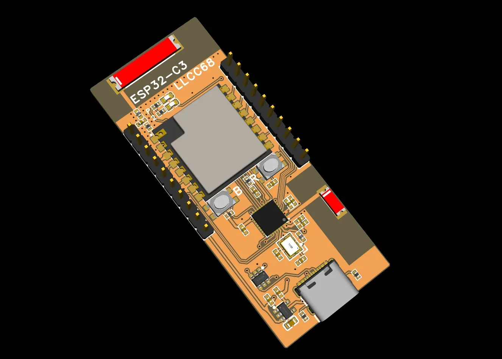
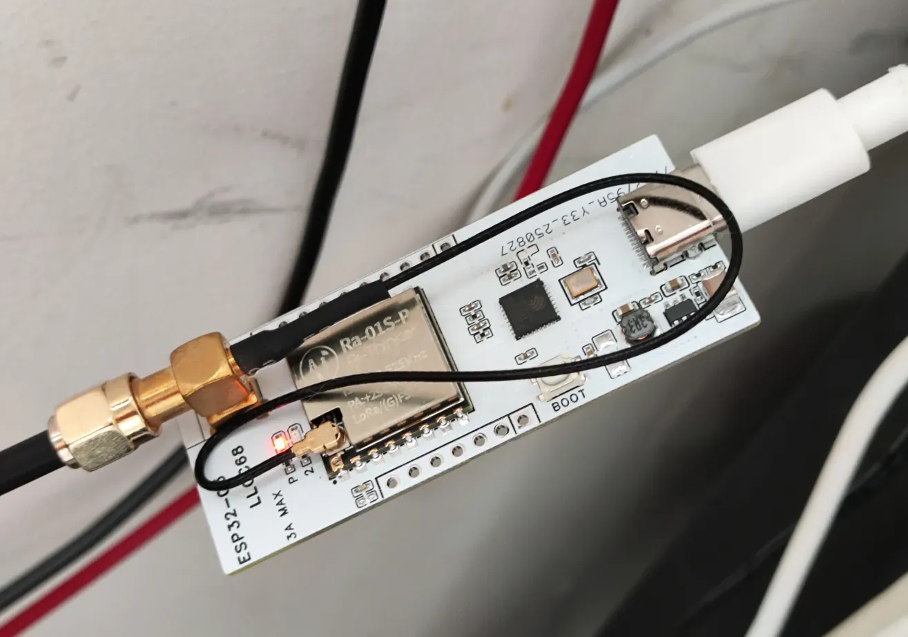
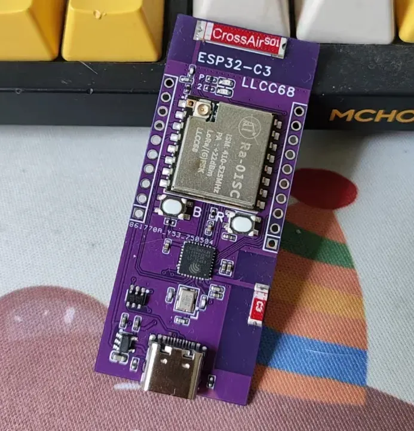
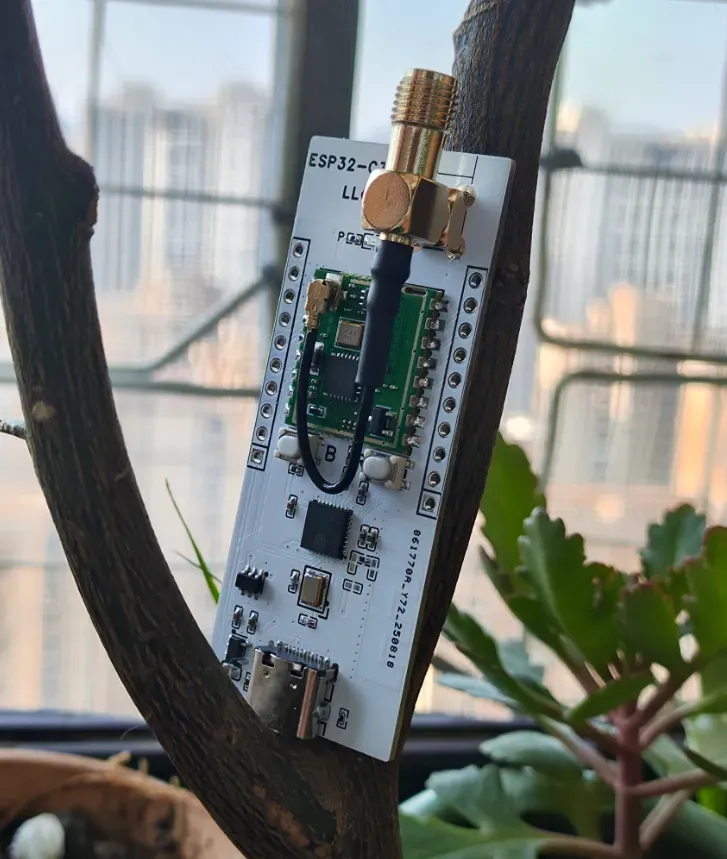
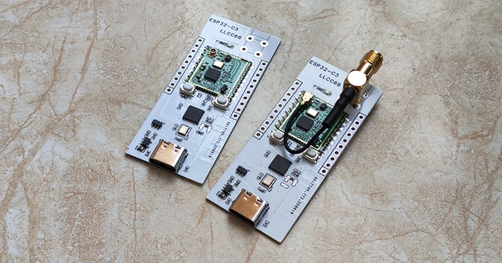
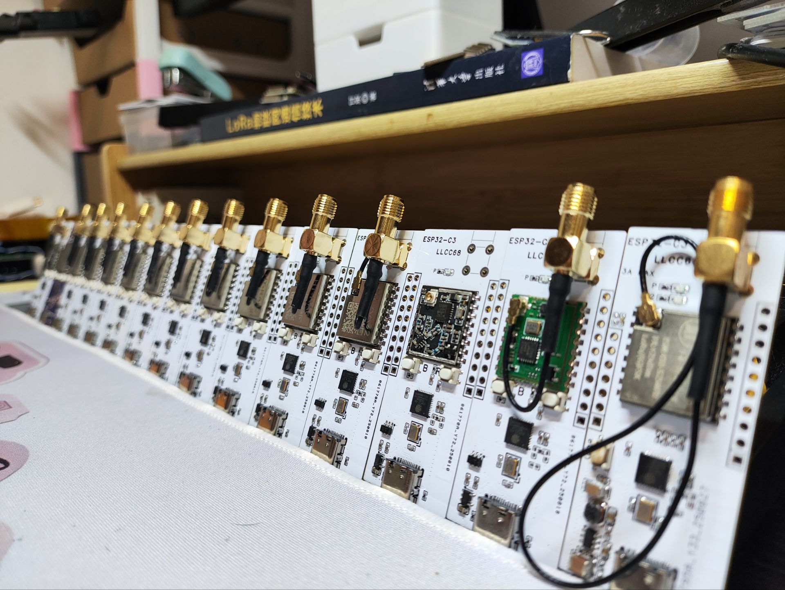
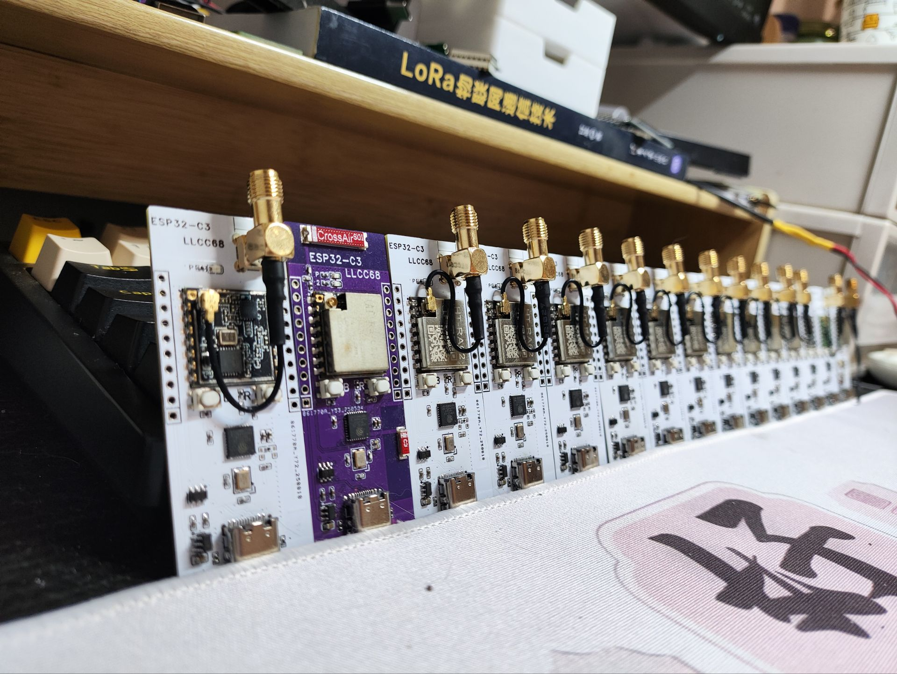

# TinyLora-C3
The cheapest Meshtastic device(in China), compatible with various LoRa modules.

## Files

- **SCH_Schematic1_2025-09-02.pdf** → Circuit schematic  
- **TinyLora-C3.zip** → PCB manufacturing files  

## Supported Modules

| Module Name | Chip | Price (CNY) | BOM Cost (excluding PCB & antenna, CNY) | Purchase Source | Notes |
| ----------- | ---- | ----------- | -------------------------------------- | --------------- | ----- |
| 255MN-L03   | LLCC68 | 9.9   | ~19.9 | AliExpress | LLCC68 does not support Meshtastic long mode, mediumslow recommended |
| RA-01SC     | LLCC68 | 11.9  | ~21.9 | AliExpress | LLCC68 does not support Meshtastic long mode, mediumslow recommended |
| HT-RA62     | SX1262 | 21.9  | ~31.9 | AliExpress | Full Meshtastic LoRa mode support |
| RA-01SC-P   | LLCC68 | 16.5  | ~26.5 | AliExpress | LLCC68 does not support Meshtastic long mode, mediumslow recommended High power, default LDO not sufficient; add an extra LDO or use a higher-power LDO/DCDC External amplifier, software setting 22 actually gives 29 |
| RA-01S-P    | SX1268 | 21.2  | ~31.2 | AliExpress | Full Meshtastic LoRa mode support High power, default LDO not sufficient; add an extra LDO or use a higher-power LDO/DCDC External amplifier, software setting 22 actually gives 29 |

## Photos

Here are some real-life photos of the TinyLora-C3:

  
  
  
  
  

  
  

*These photos show various views of the TinyLora-C3.*

## Notes / Warnings

### Antenna

- The 2.4 GHz antenna is not tested by VNA, but Bluetooth connection to a phone works fine.  
- onboard ceramic LoRa antenna, but the performance is limited.  
- If you willing to use an external IPEX antenna, remove R32 first.  
- The RA62 module only work with an IPEX antenna. Further modification on the module required if you need onboard ceramic antenna.

### High-Power Modules

1. High-power modules (all modules listed with "-P" suffix) require two LDOs connected in parallel for power supply.  
2. Check the maximum transmit power the antenna is designed to handle while using High-Power modules;FPC antenna is not recommended.

## Bill of Materials (BOM)

| No. | Qty | Name | Designator | Package | Notes |
|-----|-----|------|------------|---------|-------|
| 1   | 1   | ANT_CA-C03 | ANT2 | ANT-SMD_L5.5-W2.0 | LoRa SMD antenna |
| 2   | 1   | 100nF | C12 | C0402 | SMD capacitor |
| 3   | 1   | 10µF | C34 | C0402 | SMD capacitor |
| 4   | 1   | 10nF | C35 | C0402 | SMD capacitor |
| 5   | 1   | 10µF | C41 | C0603 | SMD capacitor |
| 6   | 2   | 1µF | C58, C59 | C0402 | SMD capacitor |
| 7   | 1   | 15pF | C60 | C0402 | SMD capacitor |
| 8   | 1   | USBLC6-2SC6 | D1 | SOT-23-6_L2.9-W1.6-P0.95-LS2.8-BL | ESD protection |
| 9   | 2   | 5AML4-11560-110-W0 | H5, H6 | HDR-TH_10P-P2.54-V-M-1 | 2.54mm pin header, optional |
| 10  | 1   | Ra-01SC | L1 | COMM-SMD_RA-01S | Ra-01SC LoRa module |
| 11  | 1   | 82nH | L2 | L0402 | SMD inductor |
| 12  | 1   | ME6211C33M5G-N | LDO1 | SOT-23-5_L3.0-W1.7-P0.95-LS2.8-BL | 5V to 3.3V LDO |
| 13  | 2   | KT-0603R | LED1, LED2 | LED0603-RD | SMD LEDs |
| 14  | 1   | 10kΩ | R7 | R0402 | SMD resistor |
| 15  | 1   | 0Ω | R32 | R0402 | SMD resistor |
| 16  | 2   | 4.7kΩ | R33, R34 | R0402 | SMD resistor |
| 17  | 3   | 100nF | U40, U58, U59 | C0402 | SMD capacitor |
| 18  | 2   | 15pF | U44, U45 | C0402 | SMD capacitor |
| 19  | 1   | 10kΩ | U48 | R0402 | SMD resistor |
| 20  | 1   | ESP32-C3FH4 | U57 | QFN-32_L5.0-W5.0-P0.50-TL-EP3.7 | ESP32-C3FH4 MCU |
| 21  | 1   | 1µF | U60 | C0402 | SMD capacitor |
| 22  | 2   | 5.1kΩ | U66, U67 | R0402 | SMD resistor |
| 23  | 2   | TVAF11-025C-R | U74, U92 | SW-SMD_4P-L4.2-W3.2-P2.15-LS5.2 | SMD push button, optional |
| 24  | 1   | TYPE-C | U91 | USB-C-SMD_TYPE-C-16P-1 | Type-C connector |
| 25  | 1   | CA-S01 | U116 | ANT-SMD_L15.0-W3.0 | 2.4 GHz SMD antenna |
| 26  | 1   | 24nH | USB1 | L0402 | SMD inductor |
| 27  | 1   | 40MHz | X2 | OSC-SMD_4P-L3.2-W2.5-BL_SIT8008BI | SMD crystal oscillator |

Custom License

This project is free for personal and educational use only.
Commercial use is strictly prohibited.
